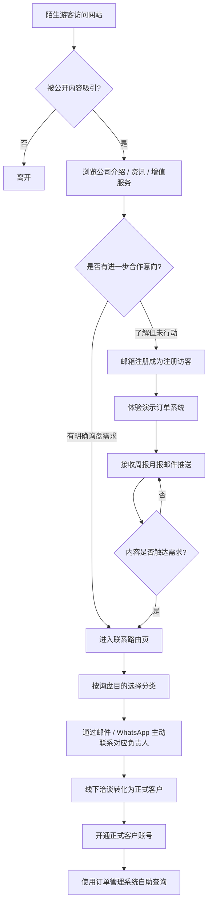
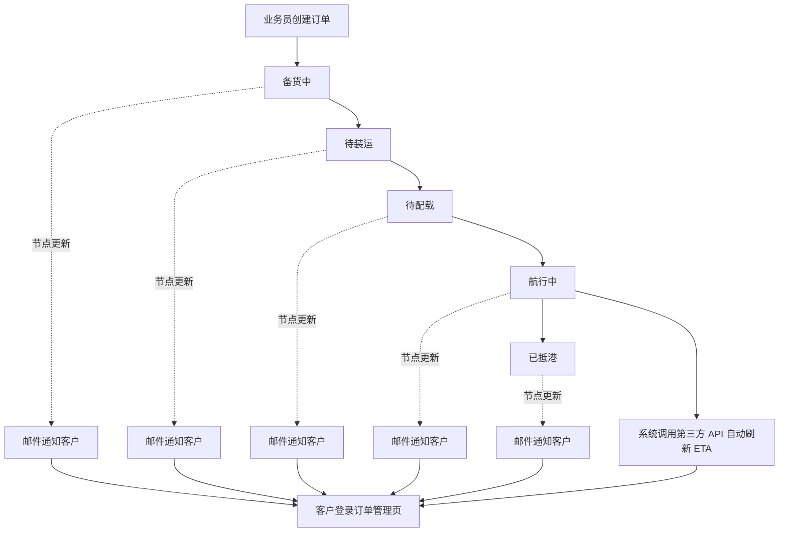
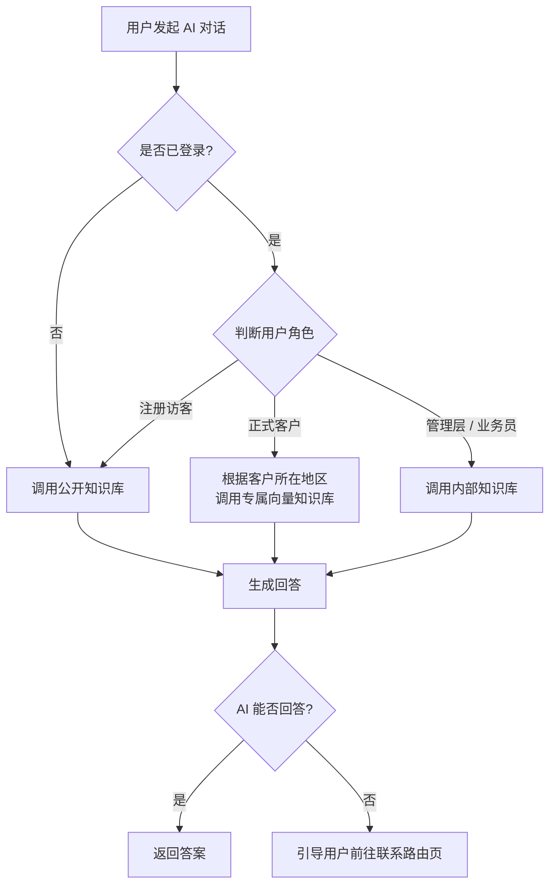
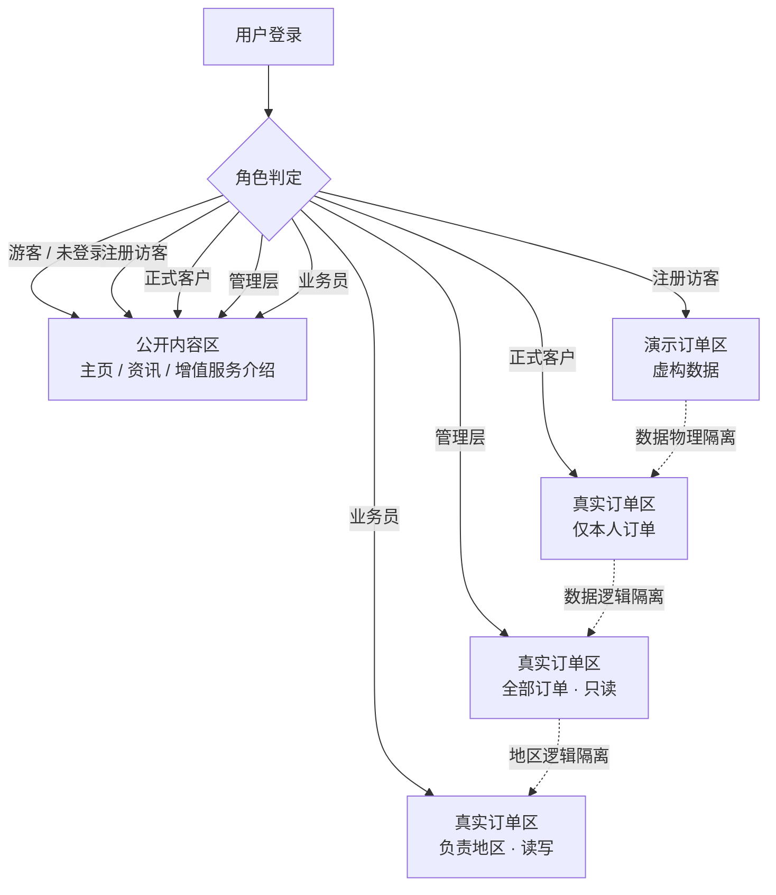

# 产品需求功能架构

**项目名称：** 农冠外贸 · 农化行业 B2B 电商平台
**文档版本：** v1.0
**文档日期：** 2026-04-10
**文档用途：** 面向公司管理层的产品功能与核心价值说明

---

## 一、一句话产品定位

本网站**不是一个比价式的商品展示货架**，而是将公司多年积累的行业洞察、行情判断与供应链资源以数字化形式呈现出来的**专业能力载体**，用以支撑区别于传统 B2B 平台的**溢价定价模式**。

---

## 二、产品核心价值主张

| 维度 | 传统 B2B 平台 | 本网站定位 |
|---|---|---|
| 竞争方式 | 价格竞争，拼低价 | 价值竞争，体现专业溢价 |
| 信息深度 | 罗列规格与报价 | 行情分析、买卖点判断、市场洞察 |
| 客户关系 | 一次性交易 | 长期合作伙伴 |
| 客户认知 | "这家价格便宜" | "这家懂行业，值得长期合作" |
| 定价策略 | 跟随市场最低价 | 凭借增值能力支撑合理溢价 |

---

## 三、用户角色总览

系统将访客与使用者划分为**五类角色**，不同角色看到的内容与权限有本质差异：

| 角色 | 身份定义 | 核心诉求 | 订单系统权限 |
|---|---|---|---|
| 游客 | 首次访问的陌生访客 | 快速了解公司专业性与能力 | 无 |
| 注册访客 | 通过邮箱注册的潜在客户 | 体验演示系统、建立信任 | 只读（演示数据） |
| 客户 | 已建立合作关系的正式客户 | 自助查询订单与物流，降低沟通成本 | 只读（仅本人） |
| 管理层 | 公司内部高管 | 全局掌握业务动态，监督决策 | 只读（全部） |
| 业务员 | 一线订单维护人员 | 管理负责地区的客户订单 | 读写（负责地区） |

---

## 四、核心功能模块概览

Phase 1 共规划 **6 大功能模块，14 项具体功能**，按其在产品中承担的角色归类如下：

| 模块 | 模块定位 | 核心功能 | 核心价值 |
|---|---|---|---|
| 订单管理系统（OMS） | 面向现有客户的自助服务中心 | 订单数据展示、时间节点追踪、ETA 自动获取、演示订单、筛选搜索 | 降低业务员重复沟通成本，提升客户满意度 |
| AI 智能客服 | 全天候专业形象代言人 | 身份感知的分层知识库问答 | 7×24 小时响应，强化专业形象 |
| 资讯内容系统（CMS） | 公司专业性与行业洞察的展示窗口 | 外部资讯自动抓取、公司自有周报月报发布 | 持续输出专业内容，支撑溢价认知 |
| 邮件自动化系统 | 与客户维持长期联系的触达通道 | 订单状态通知、注册激活、资讯定向推送 | 主动触达客户，驱动二次回访 |
| 联系路由页 | 高品牌定位下的咨询入口 | 按询盘目的展示对应负责人联系方式 | 不索取数据，由客户主动发起联系 |
| 账户与权限系统 | 系统安全与角色隔离基础 | 多角色登录、权限控制、安全登录 | 保障数据安全与角色隔离 |

---

## 五、模块一：订单管理系统（OMS）

这是现有客户最高频使用的模块，直接决定客户对公司"专业度"与"服务质量"的感受。

| 功能编号 | 功能名称 | 优先级 | 交付物 |
|---|---|---|---|
| F-OMS-01 | 订单数据展示 | P0 | 包含 14 个字段的完整订单详情页 |
| F-OMS-02 | 订单时间节点追踪 | P0 | 5 阶段状态轴（备货中 → 待装运 → 待配载 → 航行中 → 已抵港） |
| F-OMS-03 | ETA 自动获取 | P1 | 通过 Shipsgo / Searates 等聚合 API 自动更新到港时间 |
| F-OMS-04 | 演示订单系统 | P1 | 供注册访客体验的虚构订单页面，数据与真实环境完全隔离 |
| F-OMS-05 | 订单筛选与搜索 | P1 | 按编号、商品、时间、状态筛选 |

**订单完整字段：** 合同编号、商品名称、包装规格、订单数量、合同价格、目的港、ETD、船公司、提单日、提单号、箱号、ETA、付款方式与账期、订单时间节点。

---

## 六、模块二：AI 智能客服

AI 客服是"公司专业形象"的自动化延伸。系统根据用户身份调用不同层级的知识库，对外降低沟通成本，对内强化内部知识检索能力。

| 知识库层级 | 适用角色 | 内容范围 |
|---|---|---|
| 公开知识库 | 游客、注册访客 | 公司介绍、服务能力、网站使用指引、FAQ |
| 客户专属知识库（按地区） | 已登录客户 | 公开内容 + 客户所在地区的市场背景，可扩展天气气候、政策法规、市场动态 |
| 内部知识库 | 管理层、业务员 | 内部操作手册、业务流程说明，与对外内容完全隔离 |

| 功能编号 | 功能名称 | 优先级 | 交付物 |
|---|---|---|---|
| F-AI-01 | 身份感知智能客服 | P1 | 基于 RAG 向量数据库的多层级问答系统，支持中英双语 |

---

## 七、模块三：资讯内容系统（CMS）

资讯页面是公司专业性的长期输出窗口，既用于被动吸引潜在客户，也用于维系现有客户关系。

| 功能编号 | 功能名称 | 优先级 | 交付物 |
|---|---|---|---|
| F-CMS-01 | 外部资讯自动抓取 | P1 | 定期抓取指定行业网站内容，在本站完整展示 |
| F-CMS-02 | 公司自有文章发布 | P0 | 后台富文本编辑器，支持分类、定时发布、自动推送 |

文章分类包括：**行情周报、月报、市场分析、公司动态**。

---

## 八、模块四：邮件自动化系统

邮件是主动触达客户的关键通道，避免客户失联，同时用有价值的内容驱动回访。

| 功能编号 | 功能名称 | 优先级 | 触发方式 | 接收对象 |
|---|---|---|---|---|
| F-EMAIL-01 | 订单状态更新通知 | P0 | 业务员更新节点后自动 | 对应客户 |
| F-EMAIL-02 | 注册激活邮件 | P0 | 注册提交后自动 | 注册访客 |
| F-EMAIL-03 | 资讯内容推送 | P1 | 文章发布后自动 / 业务员手动 | 注册访客、客户、核心客户名单 |

所有邮件支持**中英双语模板**，根据客户语言偏好自动选择。

---

## 九、模块五：联系路由页

联系路由页是高端品牌定位下的独特设计：**不收集表单、不索取数据**，让客户按目的选择分类后自行通过所展示的邮件/WhatsApp 联系对应负责人。

| 选项 | 询盘目的 | 导向负责人类型 |
|---|---|---|
| 1 | 特殊或一般性产品采购 | 销售负责人 |
| 2 | 产品登记支持 | 合规专员 |
| 3 | 行业咨询 | 市场分析师 |
| 4 | 商业合作 | 商务负责人 |
| 5 | 其他 | 总经办 |

| 功能编号 | 功能名称 | 优先级 | 交付物 |
|---|---|---|---|
| F-CONTACT-01 | 按询盘目的展示联系方式 | P0 | 分类路由页面，支持 `wa.me/` 与 `mailto:` 链接 |

---

## 十、模块六：账户与权限系统

| 功能编号 | 功能名称 | 优先级 | 交付物 |
|---|---|---|---|
| F-AUTH-01 | 多角色登录与权限控制 | P0 | 5 种角色权限隔离、业务员按地区绑定 |
| F-AUTH-02 | 安全登录 | P0 | 密码加密、错误锁定、邮箱找回 |

---

## 十一、权限矩阵汇总

| 功能模块 | 游客 | 注册访客 | 客户 | 管理层 | 业务员 |
|---|---|---|---|---|---|
| 浏览公开页面 | ✅ | ✅ | ✅ | ✅ | ✅ |
| 订阅周报月报 | ❌ | ✅ | ✅ | ✅ | ✅ |
| AI 客服（公开库） | ✅ | ✅ | ✅ | ✅ | ✅ |
| AI 客服（地区专属库） | ❌ | ❌ | ✅ | ❌ | ❌ |
| AI 客服（内部库） | ❌ | ❌ | ❌ | ✅ | ✅ |
| 演示订单系统 | ❌ | ✅ | ❌ | ❌ | ❌ |
| 查看真实订单 | ❌ | ❌ | ✅（仅本人） | ✅（全部只读） | ✅（负责地区） |
| 修改订单数据 | ❌ | ❌ | ❌ | ❌ | ✅（负责地区） |
| 发布资讯内容 | ❌ | ❌ | ❌ | ✅ | ✅ |

---

## 十二、核心业务流程图

### 12.1 访客到客户的转化主流程

### 12.2 订单状态流转与客户通知流程

### 12.3 AI 客服身份识别与知识库路由

### 12.4 权限与数据隔离关系

---

## 十三、功能优先级汇总

| 编号 | 功能名称 | 优先级 | 所属模块 |
|---|---|---|---|
| F-OMS-01 | 订单数据展示 | P0 | 订单管理 |
| F-OMS-02 | 订单时间节点追踪 | P0 | 订单管理 |
| F-OMS-03 | ETA 自动获取 | P1 | 订单管理 |
| F-OMS-04 | 演示订单系统 | P1 | 订单管理 |
| F-OMS-05 | 订单筛选与搜索 | P1 | 订单管理 |
| F-AI-01 | AI 智能客服 | P1 | AI 客服 |
| F-CMS-01 | 外部资讯抓取 | P1 | 资讯内容 |
| F-CMS-02 | 自有文章发布 | P0 | 资讯内容 |
| F-EMAIL-01 | 订单状态邮件通知 | P0 | 邮件系统 |
| F-EMAIL-02 | 注册激活邮件 | P0 | 邮件系统 |
| F-EMAIL-03 | 资讯内容推送 | P1 | 邮件系统 |
| F-CONTACT-01 | 联系路由页 | P0 | 联系路由 |
| F-AUTH-01 | 多角色权限控制 | P0 | 账户权限 |
| F-AUTH-02 | 安全登录 | P0 | 账户权限 |

**P0（核心必做）：** 8 项 — 构成产品 MVP 的最小闭环。
**P1（重要但可稍后）：** 6 项 — 在 P0 完成后逐步补齐，不影响产品首次上线。

---

## 十四、产品特色总结

1. **反货架思维：** 不做传统 B2B 的产品目录和比价报价页，用行情洞察与增值服务表达专业性。
2. **五角色精细分权：** 游客、注册访客、客户、管理层、业务员各有独立的内容与权限边界。
3. **AI 客服身份感知：** 分层向量知识库区分公开、地区专属、内部三级内容。
4. **联系路由不收集数据：** 高品牌定位下的克制设计，由客户主动发起联系。
5. **订单自助 + 邮件主动触达：** 客户自助查询减少业务员负担，邮件持续触达保持关系温度。
6. **ETA 聚合 API：** 通过第三方货运追踪服务获取 ETA，避免对各船公司官网的脆弱爬取依赖。

---

*本文档为面向管理层的产品功能架构说明，如需技术实现细节请参阅 `PRD_Overview.md`、`User_Stories.md`、`Feature_List.md`。*
